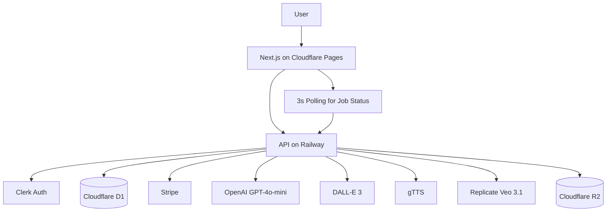
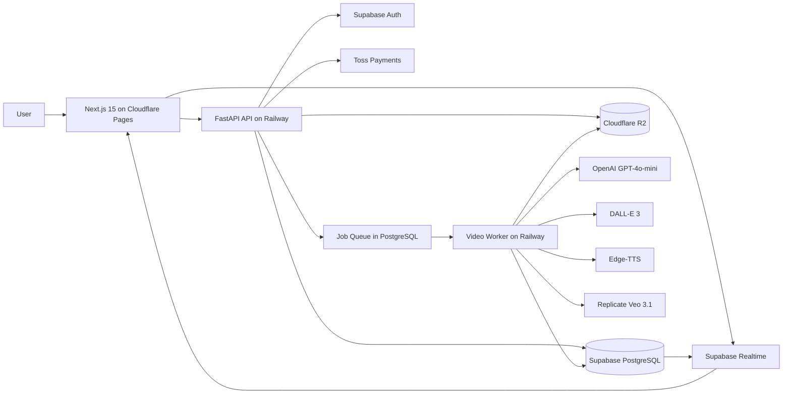

# AI Video SaaS Architecture (Step 1)

## 1) Goal and Product Scope

Step 0 프로토타입의 한계를 해결하기 위해, 한국 소규모 사업자를 타겟으로 한 영상 자동생성 SaaS 아키텍처를 정의한다.

- 웹에서 주제 입력 후 9:16 숏폼 영상 자동 생성
- 크레딧 기반 과금 (KRW)
- 생성 결과 다운로드 및 재사용 가능한 에셋 저장
- 배포: 프론트엔드 Cloudflare Pages, 백엔드 API Railway
- 데이터/인증/실시간: Supabase (PostgreSQL + Auth + Realtime)
- 오브젝트 스토리지: Cloudflare R2

## 2) Initial Draft (v1) - Review Candidate

아래 v1은 빠른 구현 위주로 만든 검토용 초안이며, 이후 검토 결과로 수정한다.

### v1 Diagram (Pre-Review)

### v1 Stack Summary

| Layer | Choice (v1) | Purpose |
|---|---|---|
| Frontend | Next.js 15 + Tailwind + Cloudflare Pages | 주제 입력, 생성 상태, 결과 다운로드 |
| API | FastAPI (Railway) | 작업 생성, 상태 조회, 콜백 처리 |
| Worker | Python video-worker (Railway) | 스크립트/이미지/TTS/애니메이션/합성 |
| DB | Cloudflare D1 | users/jobs/credit tx 저장 |
| Auth | Clerk | 이메일/소셜 로그인 |
| Payment | Stripe | 크레딧 결제 |
| Storage | Cloudflare R2 | video/thumbnail/audio 저장 |
| AI | GPT-4o-mini, DALL-E 3, Replicate Veo 3.1, gTTS | 영상 생성 파이프라인 |
| Realtime | 3초 폴링 | 상태 갱신 |

## 3) Architecture Review Findings

### A. Cloudflare Constraints

- D1은 SQLite 기반 특성상 동시쓰기 부하가 높은 크레딧 차감/작업 생성 트랜잭션에 병목이 생길 수 있다.
- Workers CPU 시간 제약은 긴 영상 처리/외부 API 오케스트레이션에 부적합하다.
- 결론: 장시간/비동기 처리 핵심은 Railway worker + Supabase PostgreSQL로 이동해야 한다.

### B. Cost Analysis Risks

- v1은 Stripe/Clerk 조합으로 한국 사용자 결제 전환율이 낮을 수 있고, 운영비 대비 매출 회수가 지연될 가능성이 있다.
- 폴링 방식은 사용자 수 증가 시 API 호출비/DB 읽기비를 증가시킨다.
- 고정 단가 가정 없이도, 호출 수를 줄이는 Realtime 전환이 비용 안정성에 유리하다.

### C. Security Risks

- 인증: 앱 레벨 권한 검증만으로는 데이터 오남용 리스크가 있어 DB 레벨 RLS가 필요하다.
- SSRF: callback URL/외부 리소스 URL 입력 시 내부망 접근 가능성이 있어 allowlist 검증 필요.
- Prompt Injection: 모델 출력 JSON 스키마 강제와 금칙어/URL 필터링, downstream sanitizer 필요.

### D. Korea Market Fit

- Stripe 단독은 한국 결제 UX와 맞지 않아 토스페이먼츠(카카오페이/네이버페이) 필요.
- 소셜 로그인은 한국 사용자 친화성(구글/카카오/네이버 연동)과 비용 관점에서 Supabase Auth가 더 적합.

### E. Ops and Reliability

- 폴링은 장애 시 재시도/복구 추적이 어렵고, 사용자 경험도 지연된다.
- 실패 작업 재처리, dead-letter 관리, 상태 전이 로그, 알림 체계가 필요하다.

## 4) Final Architecture (v2) - Approved

검토 결과를 반영해 아래 항목을 확정한다.

| Change | Before (v1) | After (v2) | Why |
|---|---|---|---|
| DB | D1 | Supabase PostgreSQL | 동시쓰기/트랜잭션 안정성 |
| Auth | Clerk | Supabase Auth | 소셜 로그인 + 비용 효율 |
| TTS | gTTS | Edge-TTS | 한국어 품질/자연스러움 개선 |
| Status Update | 3초 Polling | Supabase Realtime | API 호출 절감, UX 개선 |
| Payment | Stripe only | Toss Payments | KRW/국내 결제수단 최적화 |

### v2 Diagram (Post-Review)

## 5) v2 Data Flow

1. 사용자가 로그인 후 주제를 입력하고 생성 요청.
2. API가 사용자 크레딧 원자 차감 + `jobs` 생성 (`queued`) 트랜잭션 처리.
3. Worker가 job을 가져와 스크립트 생성(GPT-4o-mini) -> 이미지(DALL-E 3) -> TTS(Edge-TTS) -> 애니메이션(Replicate) -> 합성.
4. 결과물(video/thumbnail)을 R2에 업로드하고 `jobs.status=complete`로 갱신.
5. Supabase Realtime 이벤트가 프론트로 푸시되어 즉시 상태 반영.
6. 사용자 다운로드 링크 제공, 실패 시 `failed` + 에러 메시지 기록.

## 6) Final Tech Stack

| Domain | Final Choice |
|---|---|
| Frontend | Next.js 15, Tailwind CSS, shadcn/ui, Cloudflare Pages |
| Backend API | FastAPI on Railway |
| Worker | Python pipeline worker on Railway |
| DB | Supabase PostgreSQL |
| Auth | Supabase Auth (email + social) |
| Realtime | Supabase Realtime |
| Storage | Cloudflare R2 |
| Payment | Toss Payments (KRW, KakaoPay, NaverPay) |
| Script LLM | OpenAI GPT-4o-mini |
| Image | OpenAI DALL-E 3 |
| Animation | Replicate (Google Veo 3.1) |
| TTS | Edge-TTS |
| Output Format | 1080x1920 (9:16), Shorts/Reels/TikTok |

## 7) Cost Model (Estimation Framework)

정확 단가는 시점/플랜에 따라 변동되므로, 아래는 견적 산식을 기반으로 한 운영용 분석 템플릿이다.

### Assumptions per 1 video

- 길이: 30~45초
- 장면 수: 6
- 생성 자원: GPT-4o-mini 1회, DALL-E 3 이미지 6장, Replicate 애니메이션 6회, Edge-TTS 6개 세그먼트
- R2 저장: video + thumbnail + intermediate

### Cost Formula

`C_video = C_llm + C_image + C_animation + C_tts + C_storage + C_egress + C_infra`

`GrossMargin = (CreditPricePerVideo - C_video) / CreditPricePerVideo`

### Example Scenario (for pricing test only)

- 가정 원가: 영상 1건당 약 800~1,700 KRW 범위
- 권장 판매가(크레딧 환산): 영상 1건당 2,900~4,900 KRW
- 목표 총마진: 45% 이상

## 8) Security and Compliance Baseline

- Supabase RLS로 사용자별 row 접근 강제.
- Worker callback은 `WORKER_SECRET` + `ALLOWED_CALLBACK_HOSTS` 검증.
- 외부 URL 입력은 스킴/호스트 allowlist, 사설 IP 대역 차단으로 SSRF 방지.
- LLM 출력은 JSON schema validation + 금칙 패턴 필터 후 사용.
- 결제 웹훅은 Toss signature 검증과 idempotency key 저장.
- 개인정보 최소수집, 로그 내 민감정보 마스킹.

## 9) Operations and Recovery

- 상태 전이: `queued -> processing -> complete|failed`.
- 재시도 정책: 외부 API 실패 시 지수 백오프(최대 N회), 초과 시 `failed`.
- 모니터링: API 에러율, job latency P95, 외부 API 실패율, 결제 성공률.
- 알림: 실패율/지연 임계치 초과 시 Slack/Webhook 알림.
- 수동 복구: admin에서 failed job 재큐잉, 크레딧 자동 롤백 정책 적용.

## 10) Step 1 Checkpoint

- [x] `docs/architecture.md` 생성
- [x] 아키텍처 다이어그램 포함 (v1, v2)
- [x] 기술 스택 + 비용 분석 포함
- [x] 검토 결과 반영된 수정 버전 포함
